### The Pockets facings

:::note
You'll see two different fabrics in the photos of these instructions. The green/dark green
combination was used for a standard, pathc pocket on the outside version of `crux`. The
black with graffity fabric was used for a version with the pockets on the inside.
:::

:::note
If you are using the patch pockets (not on the inside), you may have to trim the facings a bit.
For simplicity the facings do not keep the seam allowance of the pockets in mind. So align the
facings on the pockets and mark where the seam alowance is:
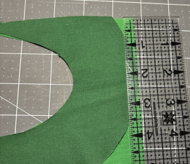
Just trim this part off the facings.
:::

Now finish the seams of the facings that are marked. You can use a serger, zigzag stitch, or
use your own favourite way to finish seams.

#### Normal patch pockets (not inside)

Press the seam allowance in for the pockets. I find this easiest by removing the seam allowance
from the pattern piece, and use that as a template:
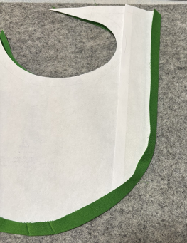

#### Cargo patch pockets

Attach the cargo strip to the pockets, right sides together. Press the strip to the wrong
side, and top stitch along the seam. This will keep the cargo strip from bulging out if
it doesn't need to be.

#### Attach facings

:::note
If you're doing the pockets on the inside, attach the facings to the front or back pattern
pieces.
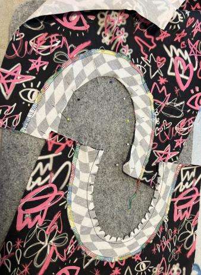
:::

Attach the facings to the pockets, right sides together. Once attached, snip the seam
allowance.
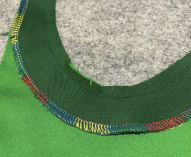
Now fold the facing to the inside, and press.

If you want to, you can add some top stitching along the seam.

### Pockets

Attach the pockets to the front and back parts. You will want to use the outline
of the pocket on the pattern piece as a guideline for laying out the pocket pieces.
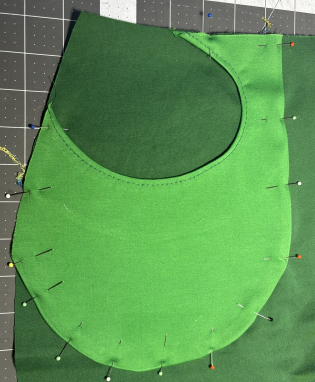

:::tip
When you have the pockets on the inside, I found it easiest to just use the pocket
as a template to sew it to the front or back parts. Just make sure you have the right
threat in the bobbin if you use a separate top stiting thread.
| | |
|---|---|
|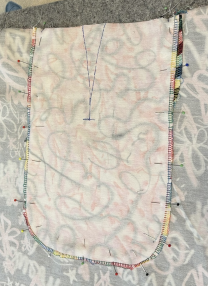|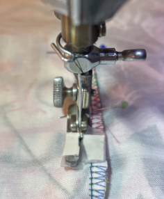|
:::

:::note
for Cargo patch pockets, press the seam alloance of the cargo strip to the wrong side
first.
:::

### Back darts

Now it is time to close the back darts. Mark the darts on the inside of the fabric, using
your favourite method to do so. I used frixion markers, but they can leave residue on some
fabrics. Chalk and basting thread work great too. To transfer the dart shape, I normally
just cut out the opening on the pattern piece and use that as a template.
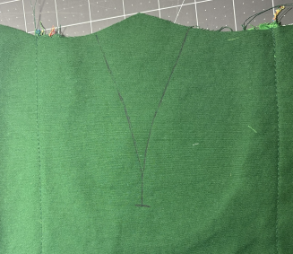
Fold the fabric along the mid-line of the dart and pin the fabric together (wrong side out).
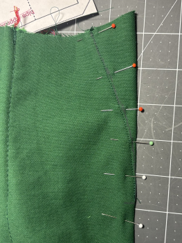
Using a small stitch length, sew the dart closed. Press the dart to the back.

### Articulated knee

:::note
You can skip this if you did not enable the articulated knee option
:::

Transfer the shape and location of the dart on the back pieces. Again, I just cut
it out of the pattern piece and use that as a template.
Do the same for the 4 front darts. I do not cut these out of the pattern piece since
it would make the pattern piece less useful in the future for additional pants. It is
also less needed, being just straight lines. I just mark them by pushing a pin through
the pattern piece and marking those on the fabric. Then I connect them with a ruler.
| | |
|---|---|
|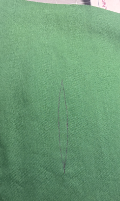|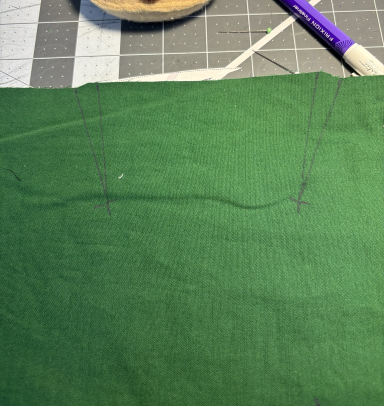|

Pin the darts and sew them with a small stitch length.
of the pant leg.

|                                                  |                                                    |
| ------------------------------------------------ | -------------------------------------------------- |
| 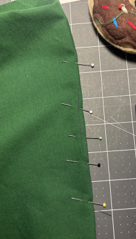 | 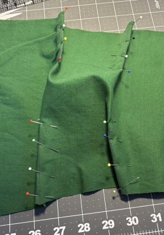 |

Press the darts towards the hem

### Back seam

align the two back pieces along the back seam, right sides together. Stitch and finish the seam.
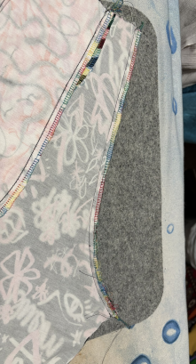
Press the seam open. You can now use top stitching along this seam if you like that look.

### Gusset

Mark all the notches on the gusset. Make sure you mark the front and back of the gusset, for
they are not identical. Align the notches of the gusset with those on the back pieces, right
sides together. Pin the gusset in place, making sure that the curves are followed correctly.

Sew the gusset to the back, starting at the notch and ending at the notch. You don't want to
sew all the way to the end of the seam allowance. The front pieces will be using this part of
the seam allowance.
| | |
| ------------------------------------------------ | -------------------------------------------------- |
| 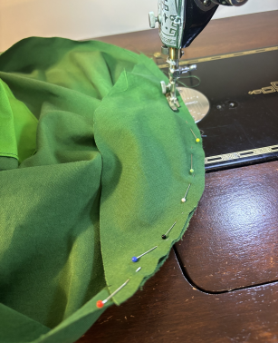 | 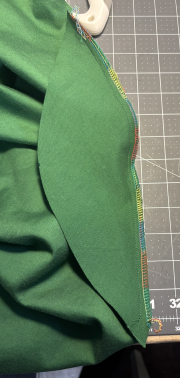 |

Finish the seam, again making sure to leave the last part of the seam allowance to the front
pieces.

### Fly construction

Mark the baste line on the inside of the right side front piece. Also mark to where the seam
goes, and where the basting starts. This is marked on the pattern with a notch.

Put the two front pieces together, right sides touching. Pin the two together, along the seam
and baste lines

|                               |                                     |
| ----------------------------- | ----------------------------------- |
| 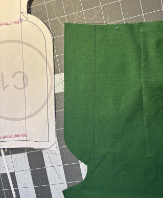 | 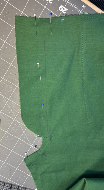 |

Sew the curved seam part, stopping at the notch. Reverse a couple of times here to lock in the
thread. Switch to a long stitch length and continue along the baste line. Lock the stitches at the end.

Cut only through the right side front piece (the one you marked earlier) from the corner to the notch.
**Do not cut the stitching!**

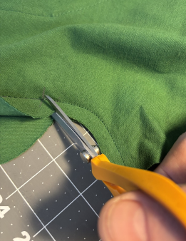
Fold the right side front piece back, and finish the seam, and along the flap.
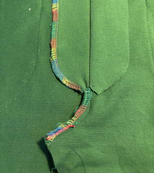
Press the seam open along the baste line.

:::tip
If you want to use top stitching along the front seam, now
is the appropriate time to do so. Make sure to fold the flap of the right piece (that you marked earlier)
back so you're now sewing through this.
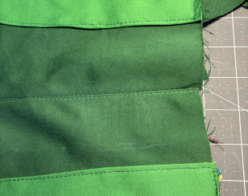
:::

With the fly flaps opened, on the wrong side of the fabric, place the zipper with the wrong side
facing you. Position the zipper on the right side flap, aligning the left side of the zipper tape
with the center seam. Pin the tape to the flap the appropriate distance from the zipper teeth. The
zipper tape sometimes has a fishbone pattern in the weave, and I use the closest valley as a guide.

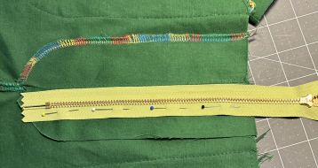

Make sure you pin _only_ the flap, and not the front piece itself.

Now pull the zipper to the other flap, keeping the front pieces beneath flat. You want to pull
it as far as it will go without moving the front pieces underneath.

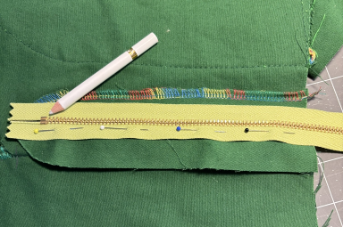

Make sure the little tab at the end of the zipper, here pointed to with the pencil, does not
exceed the flap on the left side. You will be sewing the left side flap to the left front along
this curve, and you do not want to sew into this tab. If something doesn't line up, tweak the
pinning accordingly. You want to get this placement correct before starting to sew the
zipper in place. Once you are satisfied, sew the zipper to the right flap. _Do not sew it to
the right front piece. Just to the flap._

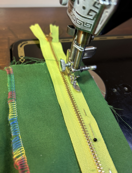

Trim the lower end of the zipper tape. Now pull the zipper back to the left side. Pin the zipper
tape to the left flap, again pinning it _only_ to the flap, not to the front piece itself.

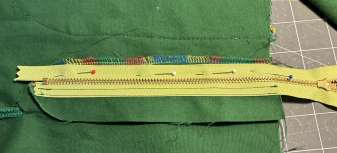

Sew the zipper to the left flap. _Do not sew it to the left front piece. Just to the flap._

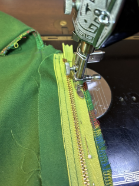

As you can see on the sewn part of the zipper, I sew two lines along the tape. You don't
need to, but it gives me confidence that the zipper doesn't come loose.
(Yes, I sew one side from the top to the bottom of the zipper, and the other side from
the bottom to the top. This way I don't have to adjust my zipper foot.)

Again, trim the bottom part of the zipper tape.

Now it is time to remove the basting stitches. Carefully cut through the basting stitches
and remove all the pieces of thread.

|                                        |                                         |
| -------------------------------------- | --------------------------------------- |
| 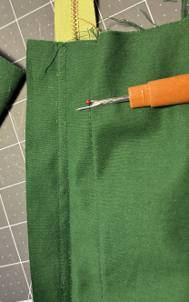 | 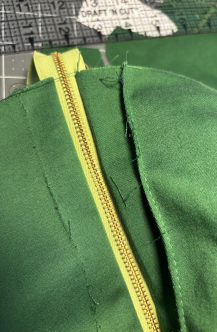 |

Fold the left front piece out of the way, and sew the right flap to the right front piece.
sew quite a bit inside the front pice. You will need to sew the zipper guard to the
right flap in a moment, and you need enough space to do so. Use some pins to see where the
best place is. On the photo I sew 1/4" (7mm) away from the removed basting line.

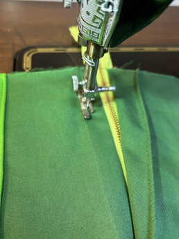

Fold the left side back so the center seam (the baste line you just removed) aligns.
Pin the fly to the piece below it.

Now flip the front parts over, and sew the left flap to the left front piece. Sew along
the left flap side, then the curve, ending up at the notch. This is the same notch where
we switched from sewing the front seam to basting the front. _If you use a different
thread for topstitching, make sure you have that in the bobbin now._

|                                                         |                                                       |
| ------------------------------------------------------- | ----------------------------------------------------- |
| 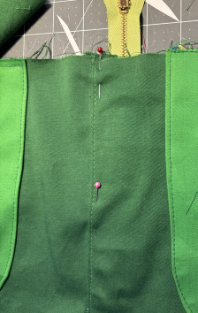 | 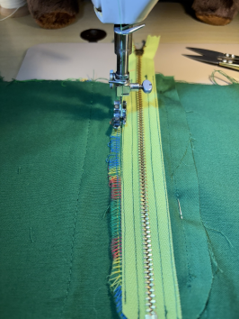 |

Flip the front back over, and it should look like this:

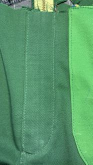

#### Zipper guard

Fold the zipper guard down the middle, along the cut-on-fold line, right sides together.
Sew the curved seam at the bottom. Trim the seam.

|                                          |                                            |
| ---------------------------------------- | ------------------------------------------ |
| 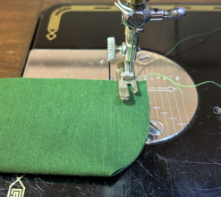 | 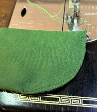 |

Turn the zipper guard inside out, and give it a good press.

Pin the guard to the right flap on the inside. This is the unfinished edge.

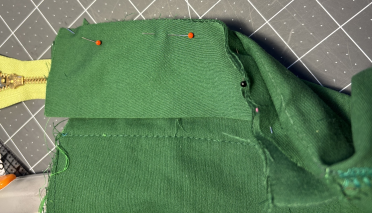

Sew along this edge to secure the guard. The bottom most part of the guard will not
be attached to the flap because the flap curves towards the middle. This is by design.

Finish the seam.

Turn the front over, and make bar tacks at the notch, and where the curved seam
becomes straight. Make sure you capture the zipper guard. You can use really narrow
zigzag stitches, or, if your machine cannot do zigzag, go back and forth multiple
times to get the same result.

|                                            |                                             |
| ------------------------------------------ | ------------------------------------------- |
| 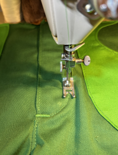 | 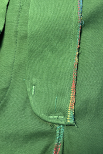 |

If your fly shield sticks a bit out like this, just trim that down to the waistband.

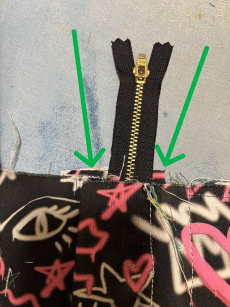

The zipper fly is done!

### Hem

Now is a good moment to press the hem for the pant legs. This will be a lot harder when
the pant legs are sewn.

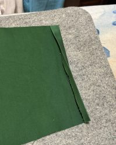

:::tip
If you want to add some pull elastic, or cord, to the hem, now is the time to put in some
grommets, or round button holes. I add both on the back pant leg, about two seam allowance
distance from the side seam edge. You can also add one to the front and one to the back pant leg,
both close to the side seam.

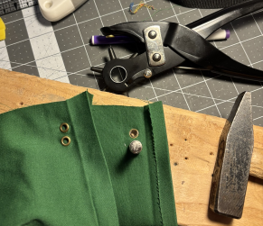
:::

### Side seam

Pin the whole side seam, right sides together. Sew the whole seam, and finish. Press
the seam to the back.

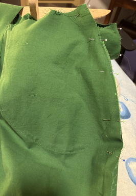

If you have been doing top stitching, go ahead and do this to the side seams now. When
the inside seam has been sewn, it's hard to get to this.

### Inside seam

Now pin the inside seam. Start with the gusset, and make sure you align all the notches.
When sewing this seam, make sure you touch the back gusset seam exactly at its end.

|                                        |                                           |
| -------------------------------------- | ----------------------------------------- |
| 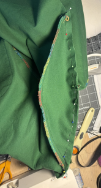 | 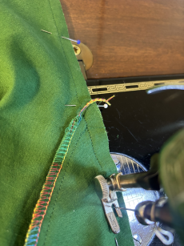 |

Finish the seam, and press to the back.

### Waistband

Press the waistband along the long spine, wrong sides together. On one side, press the seam
allowance in to the wrong side. If you intent to finish the waistband with a stitch-in-the-ditch,
press a little less than the seam allowance to give you enough fabric to catch in the stitch-in-the-ditch.

:::note
You can add an internal belt to the pants. This is a feature you see on some hiking pants. For it you will need:

- nylon webbing, about 20mm wide, at least 1.25 times your hips circumference.
- a matching Single Sided Ladder Lock Buckle

Make a vertical buttonhole about 10cm from the right side of the waistband. Very close to the
fold of the waistband. Sew the webbing to the other side of the waistband, on the inside of
the waistband, close to the seam allowance.

|                                               |                                                           |
| --------------------------------------------- | --------------------------------------------------------- |
| 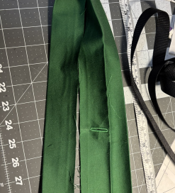 | 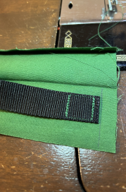 |

:::

Pin the waistband to the pants, right side together, matching the notches to the side and back seams.
Sew the whole seam.

When you're done with this seam, you can cut off the extra part of the zipper. I always buy
my zippers a bit too long and cut them after attaching the waistband.

|                                          |                                                   |
| ---------------------------------------- | ------------------------------------------------- |
| 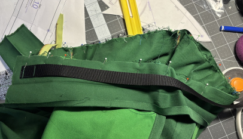 | 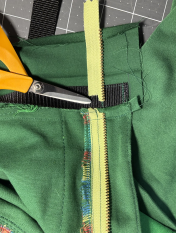 |

(Ignore the nylon webbing in the photo if you're not doing the internal belt)

Fold the waistband on each side back, right sides together. The seam allowance should be folded
back onto the waistband, like a very lopsided 'W' or 'M'. Sew the ends closed, making sure you
sew very close to the sides of the pants.

|                                            |                                     |
| ------------------------------------------ | ----------------------------------- |
| 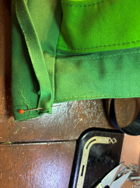 | 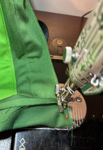 |

Trim this seam back, and cut the corners off. Turn the waistband inside out and push the
corners out.

:::note
If you're doing the inside belt, make sure you're feeding the nylon webbing through the
button hole you made earlier.
:::

Now pin the waistband to the pants. Sew them using a stitch-in-the-ditch, or a top stitch,
whichever you prefer.

:::note
When you are doing the internal belt and you're top stitching, like I did here in the
photos, make sure you keep the webbing away from where you're stitching.
:::

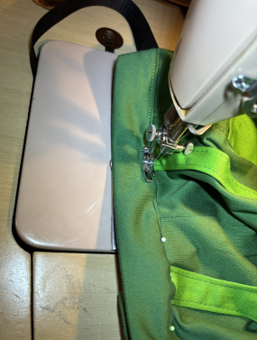

:::note
Use some of the webbing to connect the Single Sided Ladder Lock Buckle to the pants:

:::

### Finishing touches

Sew the hem. Don't forget to add the elastic or cord if you planned for that.

Create a button hole on the left side of the fly.

|                                       |                                     |
| ------------------------------------- | ----------------------------------- |
|  |  |

:::tip
Put some fray-check on the back of the buttonhole before cutting it open.
:::

Open the button hole, and mark where the button needs to go. Then add the button.

### Enjoy!
