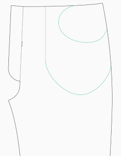
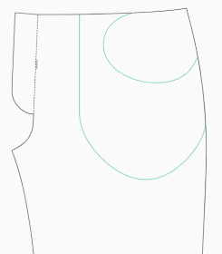

**Percentage between waist and hips**

Where the pants have the waistband can be controlled with this option. The
smaller the value, the higher the pants will be. 0% is on the waist, 100% is on the hips.

| 10%                                          | 80% (Default)                                |
| -------------------------------------------- | -------------------------------------------- |
|  |  |
