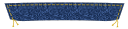

:::note

###### Top stitching ahead!

Devon needs top stitching on almost all seams. Just like your favourite pair of jeans, Devon uses top
stitching extensively. After sewing a seam, you will have to finish it, press it to one side, and top stitch it.
This means that you will have to set up two sewing machines, or apply some strategy to sewing the seams to minimize
changing threads.

With only a couple exceptions, you can leave the bobbin thread between sewing the seam, and the top stitching. Where
you need to change the bobbin, it'll be referenced here in the instructions.

Each seam should get two rows of top stitching. One close to the seam, and one a little further away. There is no
right or wrong way to do this, whatever you like best. Look at a couple of jeans and see what the distance
between the rows of stitching is. But if you'd like something different, that's fine too. Or leave the
second row out all together. Be creative.

:::

:::note

The seams should be finished. You can do this with an overlocking stitch, or flat-fell the seam. There is
no additional fabric included in the seam allowances for flat felling the seam. If you prefer that finish, make
sure you add the required extra fabric to the appropriate seams.

:::

### Step 1: Back

- Sew the Back Outside to the Back Panel
- Press the seams toward the Back Panel
- Finish and top stitch the seams

- Matching the center, pin the Back Yoke to the back
- Sew along the seam.

- Press the seam up (towards the yoke)
- Finish and top stitch the seam

### Step 2: Front

:::note
If you have omitted the front pocket, just sew the Front Side to the Front Panel, finish
and top stitch.
You can skip the pocket construction part below
:::

- Lay the Front Outside Panel on the Front Panel, matching the top side and the square flaps
- Sew along the edge above the square flap to the top notch
- Sew from the bottom notch to the middle notch
  You basically sew a seam with part in the middle left open

Press the seam open. On the front panel, with the square flap pointing away from the opening,
sew two lines of top stitching between the notches (the part you left open). Pull the ends of the
threads to the wrong side and finish.

Pull the other flap to the front panel side and align with the other flap. Sew the top of the
flaps together. You can sew the other sides together too, but they will be caught into the
front facing and waistband, so there is no real need to do so. Finish the seam and top of the flap.
Now top stitch the rest of the seam, stopping at the notches, matching the part you have already
done. Pull threads to the wrong side and finish off.
Add some bar tacks to where the notches are to strengthen the pocket opening.

:::note
If you have omitted the front pocket, continue here.
:::

Sew the front inside panel to the front panel. Make sure you're not sewing the pocket to the seam!
Press the seam towards the front panel, finish, and top stitch.

Give the resulting panel a good press.

On the front inside panel and the front outside panel, clip from the top to the notch.

:::note
You can finish this top seam before clipping it. It will make the part you're folding in
finished too.
:::

Press the little flap you created down towards the front panel. Press and top stitch.

:::note
This snip in the fabric can make the top stretch in undesired ways. Be careful with this.
:::

Finish all the sides of the pocket parts.

Center the pocket part over the opening you just created, aligning the top of the
pocket part with the top of the front panel. Top stitch along the lines indicated
on the pattern pieces, securing the pocket to the front part.

Create two big bar tacks along the side of the opening, strengthening the pocket opening.

Stitch two pocket flaps together along the sides and bottom, right sides together. Clip
corners, grade seams, and pull inside out. Press the pocket flap and top stitch along
the sides and bottom.

Create the button hole. You don't want to wait until the end to do this.

Lay the pocket flap on the right side of the front, centered over the already
sewn pocket. Align the top of the flap with the top of the front. Baste the flap
in place.

Lay the Front Yoke on top of the front piece, right sides together, aligning the bottom
of the Front Yoke with the top of the front piece. Sew along the seam.

Press the seam towards the top, finish, and top stitch.

:::note
If you are using a thin denim, it is a good idea to interface the facings.
:::

Press the Front Facing's curved side to the wrong side the width of the seam allowance.

Align the Front Facing with the front pieces, right sides together, and sew along the
long seam. Grade the seam, press open, and then press the facing to the inside on the jacket.

Repeat for the other front side.

### Step 3: Shoulders

Lay the front sides on the back part, aligning the shoulder seams. Sew along the seam.

Press the seam towards the back, finish, and top stitch.

If your fabric is not thick denim, it is a good idea to stitch along the neck opening
to reduce the chance of stretching.

### Step 4: Collar

:::note
If you are using a thin denim, it is a good idea to interface the Upper Collar.
:::

Stitch the Upper Collar to the Under Collar together along the sides and bottom, right
sides together. Note that the Upper Collar is slightly larger than the Under Collar, so
stretch the Under Collar while sewing. Clip the corners, grade seams, and pull
inside out.

Press the collar and top stitch _a single row_ along the sides and bottom. **_Note that
you should use top stitching thread in the bobbin for this one_**.

Press the seam allowance of the Upper Collar to the inside.

Pin the Under Collar to the neckline, right sides together, matching the middle and
the notches to the shoulder seams.

Fold the Front Facings over the collar and pin in place. Clip the seam allowance
of the Upper Collar at the end of the Front Facings.

Stitch along the length of the neckline, starting at one of the facings.
After the facing part, only stitch the Under Collar to the neckline. Do not
stitch the Upper Collar between the two facing pieces.

Clip the corners of the facings and turn them inside out. Clip the curved seam
of the neckline.

Clip the neckline seam at the end of the facings. Trim away some of the
neckline seam allowance under the facings so it can be hidden when the facing
is sewn down. Fold the seam allowance of the Upper Collar inward and pin to
the neckline seam. The neckline seam should be inside the collar.

Edge stitch the Upper Collar to the neckline seam between the facings.

#### Finish the facings

_Note that you should use top stitching thread in the bobbin for this one_.

Pin the facing to the front. _**Make sure you catch the
pocket flap between the facing and the front piece!**_

Mark where the end of the facing is
using the pattern piece. Top stitch along the outside of the facing.
You can also sew along the edge of the
facing on the wrong side of the front piece, _as long as you have
top stitching thread in the bobbin_.

### Step 5: Side seam

Now it is time to close the side seam. Pin the back and front sides
together, right sides matching.

Finish the seam, press to the back, and top stitch.

### Step 6: Sleeves

On the Under Sleeve, fold the extension at the opening back two times
and top stitch in place.

Pin the long seam of the Topsleeve and Undersleeve, right sides together.
Sew the seam up to the notch.

Now fold back the extension on the Topsleeve twice and top
stitch in place.

Finish the seam, press to the Topsleeve side, and top stitch
the seam. Add a bar tack to where the seam ends.

Pin the remaining seam, and sew it. Finish the seam, and press it
towards the Undersleeve. You can top stitch this seam if you
feel strongly about it. It is a hassle, and you hardly ever see
this seam.

Turn the sleeve right side out.

### Step 6: Cuffs

:::note
If you are using a thin denim, it is a good idea to interface the
Cuffs.
:::

Press the cuff along the fold line, wrong sides together. Pin the
cuff to the sleeve, right sides together, aligning the seam line
with the side of the sleeve. Sew this seam. Press
the cuff away from the sleeve.

On each end of the cuff, fold the cuff in two, against the fold you
pressed earlier. Right sides together. Fold the seam allowance of the
side you have not sewn yet to the outside. Now sew the two sides of
the cuff together, exactly next to where the sleeve ends.

Clip the corners, grade the seam, and flip the cuff right side out.
Press the inside seam allowance to exactly the stitch line you made
earlier when you sewed the cuff to the sleeve. Pin this in place from
the right side. Top stitch all around the cuff, making sure you
catch the inside seam allowance of the cuff.

### Step 7: Setting the Sleeves

Turn the sleeves right side out, and the body wrong side out.
_Make sure you set the correct sleeve to the right side of the
body (don't ask why this warning is here). The front-facing
side of the sleeve is marked on the sleeve pattern_.

Match the notch to the shoulder seam of the body. Pin all
around the sleeve opening. The sleeve does not need to be
eased in. You may still end up with extra material when you
make the round if you didn't exactly pin on the seam. If so,
just go back and forth until you dobn't have any more folds.

Since you'll be sewing a tube to something that is not a
tube, there are a lot of opportunities to create puckers or
catch a piece of fabric in the seam. Go slowly, and reposition
all the fabric often.

Finishing this seam is a bit of a problem. You will need to clip
the seam allowance along thw whole seam. I just finish it first,
and then clip the seam allowance.

When you have the seam finished, and clipped, press the sleeve
well. Make sure you press the seam allowance towards the body.

Top stitch the whole seam in the round. Again, this is where
you want to go slow and methodical. It is very easy to get
the wrong piece of fabric stuck under the foot and sewn into
the seam.

### Step 8: Waistband

:::note
If you are using a thin denim, it is a good idea to interface
the Waistband.
:::

The construction of the waistband is identical to that of the
Cuffs. Please refer to that part for the instructions. Make
sure you catch the pocket flap in the seam.

### Step 9: Finishing

Now all that is left is making the remaining button holes and
adding the buttons.

### You're done!

Go and wear your Denim Jacket with pride!
