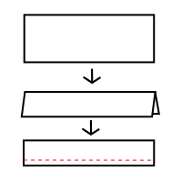
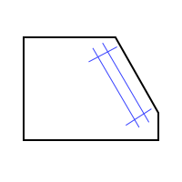
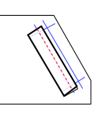
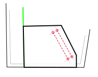
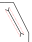

This pattern is hard to fit around the arms in the same ways Simon is hard to fit around the arms, and
complicated at the waistband and cuffs in similar ways to how Huey and Hugo are complicated at the
waistband and cuffs. If you've already made those things, this pattern will feel pretty familiar. If you
haven't, take it slow and make a muslin out of some cheap cloth first.

:::note

### Suggested modification: Button placket material

Before you cut out your front lining pieces, decide whether to make your button placket out of the outer shell or the lining. The button placket will involve 3 layers of the placket fabric folded over - if that'll be unwieldy with your outer shell fabric, use the lining for it instead.

By default, Jett's front piece extends beyond the center front further than the front lining piece. The front lining piece ends at the green line drafted on the pattern, with no seam allowance, so it can sit snug inside the button placket. The front piece extends further by the width of the placket + the seam allowance. The seam allowance folds down, then the width of the placket folds down.

To make a version of Jett where the placket is made out of the lining, you'll cut the front piece short at the green line and add the extra distance to the center front of the lining piece instead.

This image shows the front lining sitting on top of the front shell, trimmed to the green line (outlined
in black). When the pocket piece is aligned with the pocket marking on the front (purple line, outlined
in white), the raw edge of the pocket should likewise be flush with the green line.

:::

## Sew the pockets

There are many approaches to sewing welt pockets. If you have a method you already like and are comfortable with, use that method instead.

### Prepare the welts

Take your two pocket welt pieces and fold them in half lengthwise, wrong sides facing. Press them flat. Sew a straight line along the bottom edge (further from the fold) at the seam allowance.

### Mark up a pocket bag piece

Take one of your pocket bag pieces and trace the pocket welt rectangle onto it, on both sides of the fabric. Make sure the lines on both sides match as precisely as you can make them. Holding the piece up against a window may help. It'll be helpful for the alignment in the next step if you extend the corners of this rectangle out further to make a # shape.

For the purposes of this discussion, the long side of this rectangle that is closer to the diagonal edge of the pocket bag is the "top," and the long side that's closer to the body of the bag is the "bottom."

### Align the pocket welt on the pocket bag

Does it matter to you which side of your pocket bag is the right side? The right side will be the one your fingers touch when you stick your hands in your pockets.

Lay one of your pocket welts down on top of the right side of your pocket bag. Align it with the bottom edge of the rectangle you've marked. The line of stitching should lie along the bottom line, with the seam allowance of the welt piece sitting inside the rectangle, and the folded edge is outside it pointing down into the pocket bag.

If you're comfortable sewing over pins, pin this carefully in place. You can also baste along the stitching line to keep it from shifting, but be careful not to put any basting stitches beyond the top and bottom corners of the rectangle.

### Place the pocket bag on the front shell piece

Lay the front shell piece down, right side up. Lay your pocket bag assemblage on top of it right side down. Your welt piece will be sandwiched between the two pieces and completely out of view.

The inner corner of pocket bag will be secured within the button placket, but you don't want it to be folded over inside the button placket. When you lay the pocket bag down, the inner edge of the fabric (there's no seam allowance on this edge) should fall right on top of the green line that marks the fold line of the placket.

### Sew just the long sides of the welt rectangle

Did you mark the welt rectangle on both sides of the fabric? Were you careful to make it match precisely on both sides? This is where we're putting that to the test.

Sew just the long sides of the welt rectangle through all four layers of fabric - jacket shell, both layers of the welt, and pocket bag. Backstitch at the corners to secure these stitches, but be very careful not to go beyond the corners.

### Cut open the rectangle

Using a small, sharp pair of scissors (or even a seam ripper to help you with the corners), cut a >—< shape into this rectangle on both the shell fabric and the pocket bag fabric. The shape doesn't need to be precise, but the corners do. Go up as close to the corner of the stitching as you can without going past them or cutting the stitches.

### Turn and straighten out all the edges

Turn the pocket bag through the opening you've just created. When it's all straightened out on the wrong side of the shell fabric, it'll leave a rectangle shaped hole in the fabric, with the welt poking out from the seam to cover the opening. Make sure all four small triangles at the short ends of the rectangle are tucked away between the layers of fabric. Press this whole assemblage flat.

### Secure the corners

The same way you would for any other welt pocket, open up the two layers of fabric again at the short edges to sew the triangles down and secure them to the short sides of the welt.

### Close the pocket bag

Align another pocket bag on top of the one you've just secured to the front shell. Pin around the corners and stitch along the top, diagonal, and outer side edges to secure these together. Be careful just to sew the pocket bags together and not to attach them to the shell fabric. For the inside edge and bottom, baste both pocket bags together to the shell fabric within the seam allowance.

:::note
There's no actual reason why you can't sew the pocket bags to the outer shell piece at this step. If you do, the shapes of the pockets will be visible from the stitching on the outside of the jacket, but that's a style choice you can make.
:::

## Sew the bust dart seams, if you have them

Close the seams for the bust darts on the front pieces, for both the outer shell and the lining. Press the darts downward.

## Sew the yoke, if you have it

Attach the yoke to the top of the back piece, right sides together, then press this seam flat.

## Assemble the body

Follow the [Brian assembly instructions](/docs/designs/brian/instructions) for both your shell pieces
and your lining pieces.

The "Right" side of the lining is the side that will be against your body when the jacket is complete.
The "wrong" side will be entirely enclosed within the layers of the jacket and invisible.

Don't worry about finishing these seams, because they'll all be enclosed, but press each seam open flat
as you go.

## Prepare the cuffs

With good sides together, sew the short edges of the cuffs together to create two bands. Press these
seams flat, then fold the cuffs in half lengthwise, matching the wrong sides. The resulting bands should
have two raw edges at the bottom and a nice fold at the top.

## Attach the cuffs to the first layer

You can choose whether you want to attach the cuffs to the shell or the lining first - it won't
affect the construction. I think the seams look a little neater if you do the shell first.

Take your shell and turn the sleeves right side out. Matching seams and raw edges, pin the cuffs to the
sleeves good sides together. The cuffs will be shorter than the edges of the sleeves, so you'll need to
stretch the cuffs as they're sewn.

Pin this area thoroughly, moving it around to be sure the stretch is evenly distributed, before you sew
around the end of the sleeve to attach the cuff. Press the seam allowances up into the sleeve.

## Attach the collar

Fold the collar in half lengthwise, wrong sides together. Baste along the edge at the standard seam
allowance to hold it together. Attach this to the neck of the shell the same way you attached the cuffs.

Take note: if you're attaching this to the shell you trimmed in the first step, stretch it all the way from
one end of the neck hole to the other. If it's the piece you didn't trim, only go between the green lines.

Line it up on the right side, stretch and pin it carefully, sew along the same line of stitches you
just basted, and press the seam allowance down into the body of the coat.

## Prepare the waistband

Sew one waistband end piece to each end of the long ribbing piece. Press these seams flat.

Fold the long piece in half lengthwide, right sides together, and sew the two ends. Turn it inside out
so the right sides are out, and press these seams at the corners so they're crisp.

## Attach the waistband

This step depends on which side you picked for the button placket in step 1. You'll be sewing the
waistband to whichever front piece extends further at the center front. Align the edges of the waistband ends at the same green
lines and pin them in place. Just like with the cuffs, the waistband is shorter than the jacket hem, so
you'll need to evenly stretch it between the two waistband ends and pin thoroughly before you sew it down.

## Prepare to attach the lining

    Fold box pleats into the center back lining at the top and bottom. The final length of the neck curve and the bottom hem with these pleats added will be exactly the same as the length of the neck curve and the bottom hem on the shell pieces, so use that to check your work. Iron these pleats into place and baste them closed within the seam allowance.

    Fold the ends of the jacket shell sleeves - or whichever sleeves you haven't attached a cuff to yet -
    to the wrong side at the standard seam allowance and press.

    

    Turn the jacket lining "wrong" side out and the jacket shell right side out.
    You'll have to take the ends of the jacket lining sleeves and feed them up through the sleeves of
    the shell, so they poke out the ends. Be careful not to twist the sleeves as you do this - the seam
    at the bottom of the sleeves should stay aligned.

## Attach the lining at the sleeves

    This is the hardest step. Starting at the bottom seam, align the folded-over edge of the sleeve
    lining with the line of stitches where you attached the cuff. Work slowly. Use a pin every
    centimeter/half-inch or so.

    

    

    Then sew this seam right at the folded edge. You're working in a small
    circle and through a lot of layers, so be careful and be patient.

## Baste (most of) the button plackets

    On each side of the front shell, fold the button placket over at the seam allowance and press...

    

    Then fold it at the green line and press. You should be able to slip the lining layer and the
    pocket bag neatly up with the folded edge. Baste this down, but leave about an inch free at
    the top and bottom of the seam.

    

## Attach the lining at the waistband and collar

This is the same method you used to attach it at the cuffs, but easier, because you're not working in
a tiny circle.

Fold down the seam allowance of the lining along the top collar edge and the bottom waist edge. Pin the
folded edge in place, aligning it with the line of stitches that attached the waistband/collar. The raw
edges of the lining and the waistband/collar should all be enclosed up under the lining.

If the lengths don't look right, and your lining is too wide or too narrow, you need to add or remove some extra fabric from the pleats before sewing them down.

Sew a straight line close to the edge of this folded fabric to secure it to the shell.

## Fold the button plackets and sew the waistband

    Fold the ends of the button plackets up into the jacket as you fold and align the end of the second
    layer with the line of stitching on the waistband, just like you did with the cuffs.

    Repeat the same process to neaten up the top edge of the plackets at the collar.

    Once this is pinned in place, edge-stitch horizontally along the bottom of the folded edge of the
    placket, then up along the basted edge all the way to the collar.

    

    

## Finish button placket

Attach buttons or snaps to the button plackets. The bottom button or snap should go on the waistband ends,
not on the shell pieces themselves.

## And you're done!
