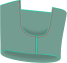
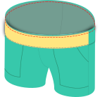

:::note

If you're using woven fabric, raw edges can and will fray.

Think about how you want to finish the raw edges. Possible options are:

- serge them with an overlock machine
- finish the edges with a zigzag stitch
- use pinking shears
- flat fell the seams
- encase the seam allowance in bias binding

Depending on which method(s) you choose, you may need different seam allowances and techniques.

Shale is a good opportunity to try out different methods.

:::

## Step 1: Prepare the pockets

Skip to step 3 if you don't want to add pockets.

Align the pocket lining with the pocket from the main fabric good sides together. Pin them together so that the
seam allowance of the lining is a millimeter further outwards than the main fabric.

Sew along the curved pocket opening, the opposite vertical side and the bottom edge of the pocket.

Trim/snip seam allowances, especially at the corner and curve.

Turn the pocket inside out through one of the two remaining openings and press, making sure to tuck the lining a bit under
so that it isn't visible from the outside.

Repeat for the other pocket.

## Step 2: Attach the pocket to the front

Pin the lining side of the pocket to the good side of the matching front piece so that the raw edges on the top and side are aligned.

Topstitch close to the edge along the vertical side and the bottom.

Treat the pocket as part of the front piece for the following steps.

## Step 3: Join the sides

Skip this step if you're not using separate front and back pieces.

Take matching front and back pieces and join them together along the sides, good sides together. If you've selected a side slit,
start at the top and stop at the marked notch.

Finish the sides. If you're doing a side slit, I recommend folding the seam allowances open and under towards the seam and edge stitching them.
This can transition into a hem-style seam below the split.

If you've made a side slit, reinforce the top of the slit with a bartack.

Repeat for both legs.

## Step 4: Join the inseam

You should now have two mirrored leg pieces. Take one and join the inseams together good sides together.
Do the same with the other leg.

## Step 5: Join the cross-seam

Insert one leg into the other good-sides together. (You'll need to turn one leg inside-out.)

Join them along the cross-seam.

## Step 6: Interface the front waistband

Follow the [Paco instructions for the waistband](/docs/designs/paco/instructions/#step-10-place-eyelets-for-the-draw-string-optional), if
you're sewing the waistband as one piece.

Otherwise, follow the following steps.

Apply fusible interfacing to the wrong side of one of the curved front pieces. This piece will become the outside later.

:::tip

Applying fusible interfacing is optional, but results in a cleaner look.

Feel free to skip this if you're creating some rather casual shorts e.g. for sleepwear.

:::

## Step 7: Join the front waistbands

Good sides together, join the fronts along the upper curved side.

Unfold and _edge stitch_ the seam allowance towards the inside front piece (the one without the interfacing).

Fold both parts wrong sides together along the original seam (not the edge stitching you just did) and press.

## Step 8: Add the elastic to the back waistband

Determine how much elastic you need to hold up the shorts comfortably.
For that pin a length of elastic to the front waist pieces and check how it feels if you put it around your waist.
The pattern gives you an estimate for how much elastic you probably need, but different types of elastic will stretch differently,
and you may also prefer a looser or tighter fit.

Cut that length of elastic (plus two seam allowances).

Fold the back part wrong sides together along the long edges, press the fold line (marked on the pattern). Unfold.

Put the elastic on one side of the back part, so it is aligned with that fold line. Sew that elastic on one short side, then the other.
Try to sew a bit closer to the edge than your normal seam allowance.

Note that the elastic is much shorter than the back waist piece, so you'll have to bunch it up a bit.

## Step 9: Topstitch the elastic

This step is optional but recommended.

Fold the fabric around the elastic, good sides outside and topstitch one to five rows on top of the back waistband.

:::warning
Ignore the seam allowance when centering your seams!
:::

This keeps the elastic aligned and evenly distributed for the following steps and when wearing it.

You need to stretch the elastic while sewing until the fabric is flat. Make sure the elastic is pinned or clipped
to the folded edge and the seam allowance is free.

## Step 10: Join front and back waistband pieces

Take the (curved) front waistband, open the fold and place it good-sides-up on your work surface.

Place the folded back waistband on top of the front waistband, aligning the raw edges.
Align the fold with the seam on the front waistband (1). Try to be precise here.

Fold the front waistband pieces together, enclosing the back waistband (2).

You're putting a V shape inside another V shape, with good sides together. Make sure the tips/folds are fully against each other.

Sew along the side, using regular seam allowance, so the seam you did in the previous step is inside the seam allowance.

Align and sew the other side the same way to form a waistband loop.

Pull out the back part from the folded front part, turning all the good sides outside.
The seam allowances should now be hidden.

## Step 11: Join the waistband

Pin the waistband along the good side of the upper edge of your pants, aligning the raw edges.
The outside of the waistband (the side with the interfacing) should be against the good side of the pants.
Match the outseam/sideseam with the two seams of your waistband, so that the half without the elastic is at the front.
You will need to stretch the elastic (but not the fabric) while sewing so that the fabric is flat.

## Step 12: Hem the bottom edge

Hem the legs by folding the fabric twice along the bottom edge. Press and topstitch.

## Step 13: Enjoy!

Your Shale Shorts are finished! I hope you enjoy them.
