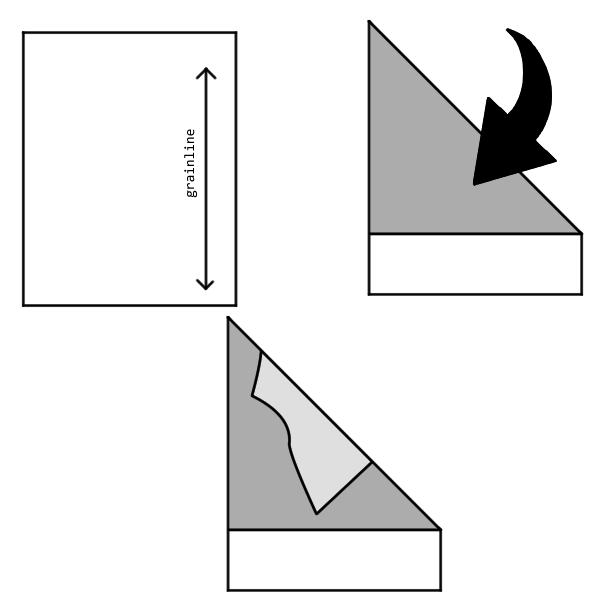
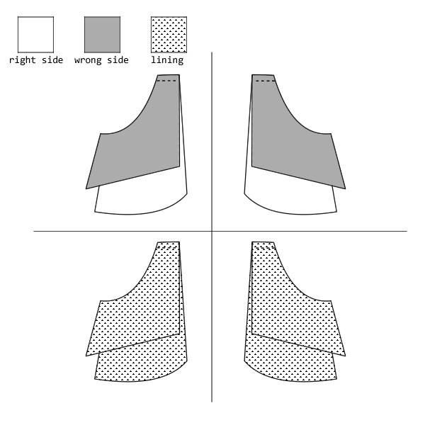
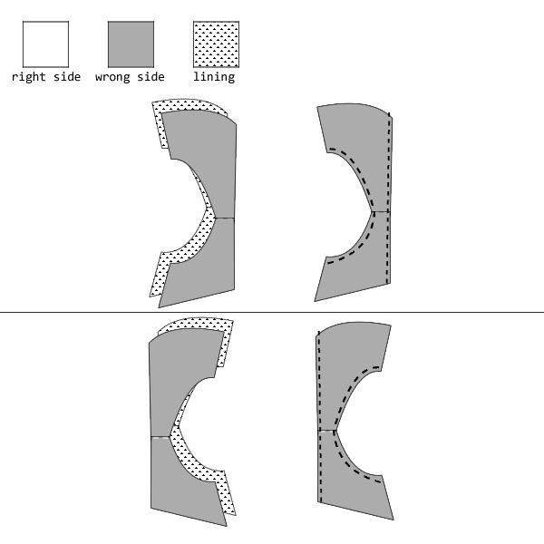
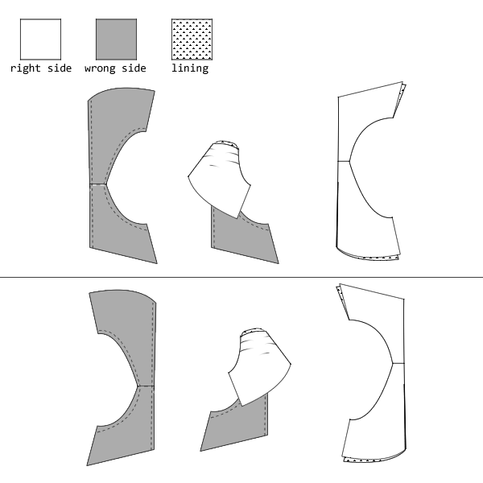
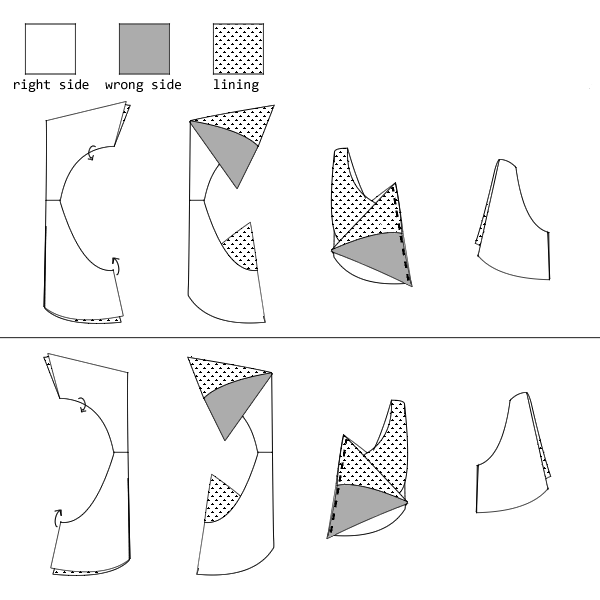
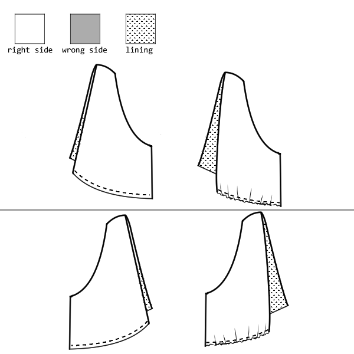
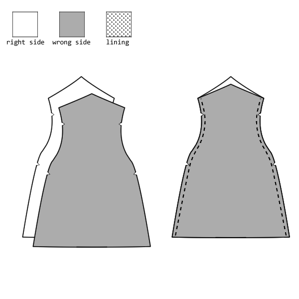
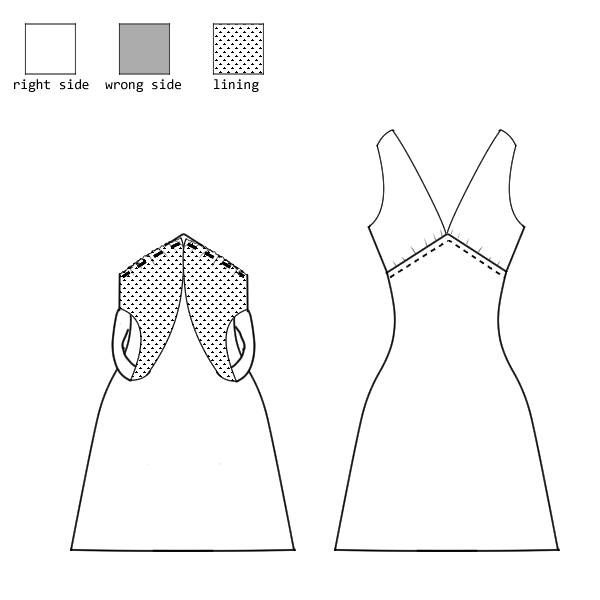
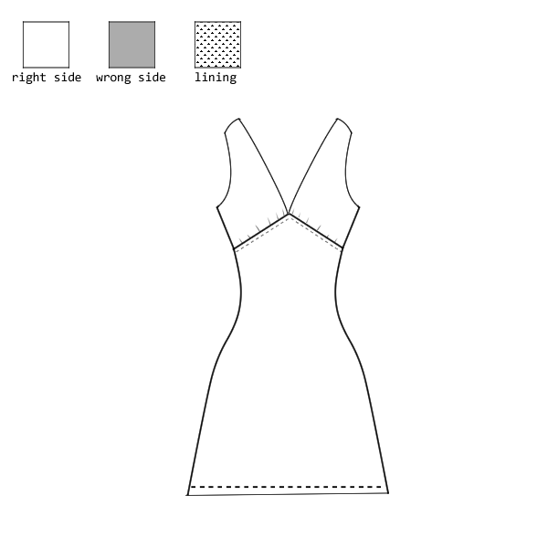

:::note

##### A note about cutting on the fold on the bias

The front and back panel pieces of this pattern need to be cut on the fold, on the bias.

This can be accomplished by folding your fabric diagonally across the grain and placing each pattern piece on the diagonal fold.

:::

## Step 1: Attach cups to back straps

Sew each cup piece to its coordinating back strap piece at the top of the strap.

## Step 2: Attach top pieces to their lining counterparts.

Match the main fabric cup/back-strap pieces to their lining counterparts, good sides together.

Sew them together along the armholes and along the neck holes.

## Step 3: Turn the top pieces right side out

Use a loop turner or chopstick coax your fabric to turn your top pieces right side out and press.

## Step 4: Sew the side seams of the top pieces.

Pin together the bottom side corners of your cup and back-strap pieces in the main fabric.

Then pin together the bottom side corners of your cup and back-strap pieces in the lining fabric.

Sew between these two points

## Step 5: Add Gathering to the cups

Sew a basting stich along the bottom of cups, go through both the main and lining fabric.

Pull on the loose thread of the basting stich to create a gather.

Try to gather the cup fabric until the seam line at the bottom of the cup is the same length as the seam line on the front panel piece between the top centerpoint and the top of the side seam.

## Step 6: Attach front and back panels together.

Put front and back panels on top of each other with good sides together.

Sew the side seams.

Turn right side out.

## Step 7: Attach the top pieces to the bottom piece.

Place the top pieces around the bottom piece right side together.

Try to match the bottom inner point of each cup to the top centerpoint of the front panel, the top side seams the bottom side seams, and the bottom inner points of the back straps to the top centerpoint of the back panel.

Sew all the way around.

Press the new seam down and top stitch it so the seam allowance doesn't pop up and show during wear.

## Step 8: Hem The bottom

Hem the bottom of the dress.

There you have it, you're done 💃

Enjoy your sophie slip!
