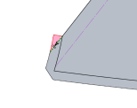
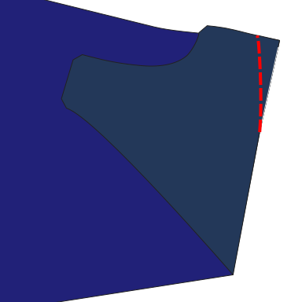
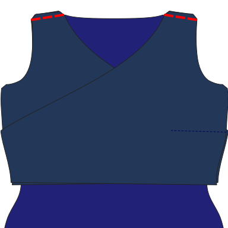
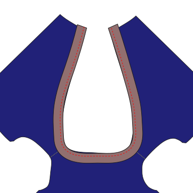
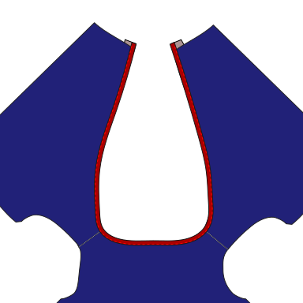
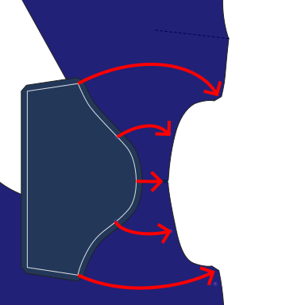
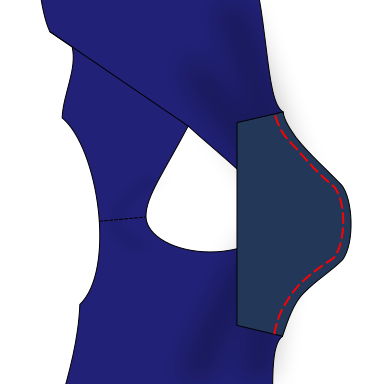
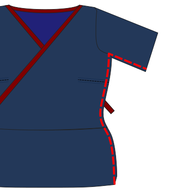
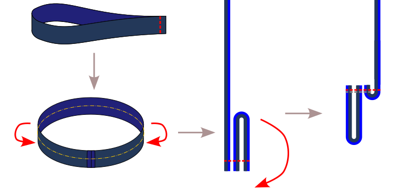

:::note

As with all knits and stretch fabrics, a serger/overlock will make your life easier, but don't worry if you don't have one.
Toni can also be sewn using a short, narrow zigzag stitch (~2 mm wide) on most standard sewing machines.

For the steps that require topstitching, a coverstitch works best. If you don't have a coverstitch, a twin needle can also give good results.
If neither option is available, you can use a zigzag stitch.

:::

## Step 0: Prepare the fabric

Cut out the pattern parts including seam allowance and transfer all markings and notches to the fabric.
Note that this design features an asymmetrical set-in sleeve. There are two different kinds of notches to help you place the asymmetrical sleeve correctly: the x-notch and the round-notch.
The x-notch identifies the back edge of the sleeve. The round-notch identifies the front edge of the sleeve.

Tip: Use a different notch shape or a different color pen/chalk for each kind of notch.

If present, trim the highlighted triangle from the seam allowance of both front parts.
It's only present on the pattern for technical reasons and would be in the way when finishing the diagonal edge.

## Step 1: Prepare the front part

Depending on the measurements used, the design can include a bust dart. This dart will be located
on the front part side seams. Sewing the dart is optional. [Some alternatives are listed below](#alternatives).

If your pattern does not contain a dart, which will be the case for most people, skip to [step 2](#step-2-sew-the-shoulder-seams).

### Sewing the dart

To form each dart, fold a front part _good sides together_ along the center line of the dart.

Sew along the dart line, from the side seam towards the bust, using an elastic stitch.
Near the dart tip, stitch parallel to, and as close to the fold as possible, tapering smoothly to the folded edge.

Do not backstitch near the tip; secure the ends manually. As an example, you can hand-sew the ends into the dart.

Flip or press the dart downward, towards the hemline.

Repeat this step for the other front part.

### Alternatives

If you want to skip the dart construction, you can gather or pleat the fabric instead to match the side seam lengths.

Alternatively, if you plan to color block the garment, you can move the dart to a color block seam.

## Step 2: Sew the shoulder seams

Match up the front and back parts along the shoulder seam (between the neck and the armholes). Place them _good sides together_ and match up the raw edges.

Sew using an elastic stitch. Repeat for both sides.

## Step 3: Finish the neck and front edge

Unfold the main body piece again.
Pin the knit binding piece for the neck _good sides together_ on the diagonal front edges and on the back of the neck,
matching raw edges. Add more stretch to the binding where it curves, so it stays flat against the neck later.

Adding additional stretch along the front parts can also help prevent gaping,
but don't overdo it, as it could distort the general shape.

Topstitch both parts together.
The distance of the stitch to the raw edge is the width of the knit band divided by four.
This is not necessarily equal to the standard seam allowance.
For example, if your knit band is 6 cm wide, sew 1.5 cm from the edge.

You should have some length of knit binding left over at the end of the diagonal front edges.
Leave them as is for now. They will be later stitched into the side seam (or waistband, depending on settings) to secure them.

Fold the neck binding upwards and to the inside of the top.
This will create a fold at the stitch line you just created,
and another one at the original raw edge of the front and back parts.

Topstitch the neck binding in place from the outside.

Trim loose fabric on the inside to reduce bulk.
The inside edge can be left raw if you're using knit fabric.

### Step 4: Sew the sleeves

If your pattern doesn't have a sleeve part, skip this step.

For set-in sleeves, be aware that the sleeve shape in the design is not symmetrical.

Pin the sleeve part to the front and back body parts, _good sides together_, matching notches and raw edges.

Note: When you are pinning the sleeve into the armhole, the sleeve hem/wrist side points toward the neck opening.

Ensure that you match the ×-notch of the sleeve to the back part and the round notch to the front part.

Sew with an elastic stitch. Repeat for the other sleeve.

### Step 5: Join the front parts

If your design has a front bottom piece, pin or baste it to both bottom edges of the triangle-shaped front parts,
_good sides together_, matching notches and raw edges.

If the outer sides of the front pieces have notches, also align and pin or baste them.

The front part that should be later fully visible on the outside goes towards the bottom part.

If your design has a front bottom piece, sew all three parts together along the bottom line while keeping any pins on the side seam in place.
Otherwise, just keep them pinned or basted together for the next step.

:::note
You can add an elastic band to the seam between the top and bottom front pieces to add some
compression there. This is especially useful if the seam is right below the bust,
and you want to use the upper portion of the top like a basic bralette.
:::

### Step 6: Sew the side seams

With _good sides together_, pin the sides of the front parts to the sides of the back part.
If present, also pin the bottoms of the sleeves together.

:::note
If you haven't created a dart in the first step, the side seam on the front part might be a bit larger than the one on the back part.
In that case, stretch, gather or pleat the fabric in the region of the bust and armpit.

Hand basting the seams together first can help.
:::

With the front parts on top, sew using an elastic stitch. Repeat for both sides.

If necessary, trim any remaining loose ends of the knit binding.

### Step 7: Create the hem

#### Using a waistband

If you've chosen to finish the hem with a waistband,
sew together the short sides of the waistband, _good sides together_,
to create a tube.

Then fold the fabric in half along its length, raw edges together, so the good sides are outside.

With the main body piece turned inside-out, pin the ribbing tube inside the bottom opening, matching raw edges.
Mark and align quarters for a consistent stretch.
The ribbing is a bit shorter, so stretch it a bit while pinning.

Sew using an elastic stitch.

Fold the hem to the outside.

Optional: Topstitch the seam allowance towards the main body piece to keep it in place.

#### Simple hem

If you've chosen the option without a waistband,
fold over the hem allowance to the inside and topstitch in place using an elastic stitch.

### Step 8: Finish the armholes

Finish the arm openings the same way you finished the neckline (for sleeveless designs) or the hem (for designs with sleeves).

### Step 9: Finishing

You're done. Time to try it on.
If the front parts are too loose, you could hand-stitch them together at the neck opening or add a closure,
like a button or a bit of hidden hook and loop tape.
