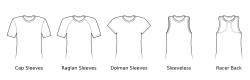
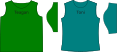

import Knitease from '@site/docs/docs/designs/toni/options/_knitease.mdx'

Toni is a configurable t-shirt or top design that supports different sleeve styles:

Toni gives you the choice to create something that fits your body and your preferred style.

It has basic support for fitting large busts, bellies and bums.
These special adjustments are only enabled if you provide the related optional measurements.

If you only supply the minimal measurements or if these adjustments aren't deemed necessary,
this will result in a shirt without these adjustments where front and back parts are
the same below the armhole. (You can use this to save paper by only printing one part in full.)

I've tried to keep the options as simple as possible,
and I've implemented some lessons I learned from making previous designs (especially _Bibi_):

- Keep the design simple
- Only add options for stuff that's relevant
- Only add options for stuff that you actually can and want to test
- Don't try to fit body measurements exactly if it results in strange shapes

Compared to _Teagan_, Toni is by default more fitted, has a more circular neck opening and
longer sleeves:

Teagan's default settings follow a standard menswear t-shirt design (plus the slight boat neck), whereas Toni defaults
to a somewhat fitted t-shirt design somewhere in-between a regular womenswear top and a semi-fitted menswear design.

You can (and should) adjust the options and ease values according to your preferences.

<Knitease />

Toni is extensible and can be used as a base for your custom designs.

Feel free to add color blocking or other accents to make the design more unique.

There are also some more patterns based on Toni:

- [Hannah](../hannah/) is Toni turned into a hoodie.
- [Tina](../tina/) is Toni turned into a faux wrap top.
