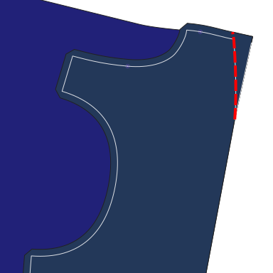
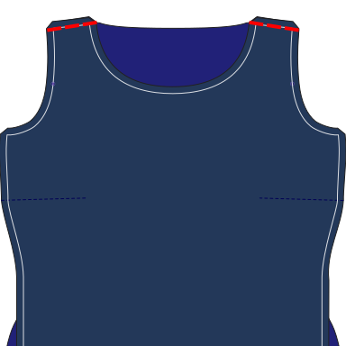
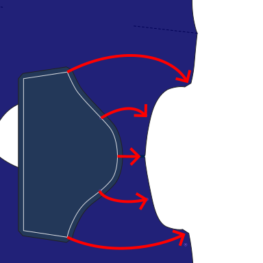
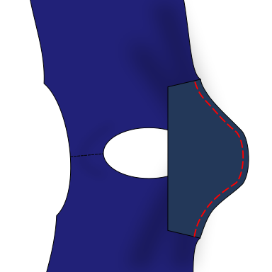
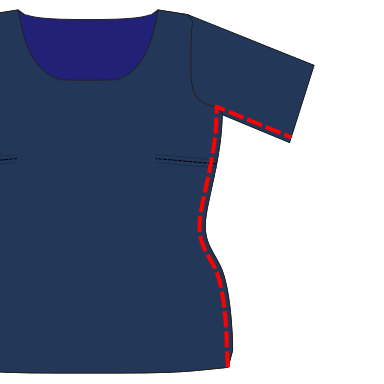
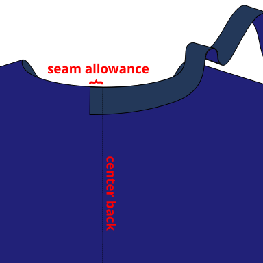
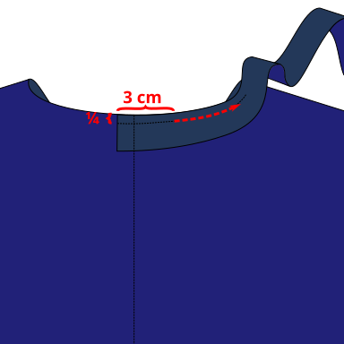
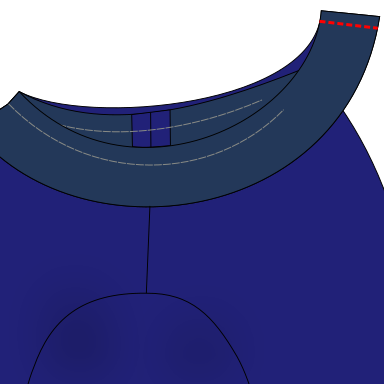
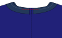
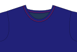

:::note

As with all knits and stretch fabrics, a serger/overlock will make your life easier, but don't worry if you don't have one.
Toni can also be sewn using a short, narrow zigzag stitch (~2 mm wide) on most standard sewing machines.

For the steps that require topstitching, a coverstitch works best. If you don't have a coverstitch, a twin needle can also give good results.
If neither option is available, you can use a zigzag stitch.

:::

## Step 0: Prepare the fabric

Cut out the pattern parts including seam allowance and transfer all markings and notches to the fabric.
Note that this design features an asymmetrical set-in sleeve. There are two different kinds of notches to help you place the asymmetrical sleeve correctly: the x-notch and the round notch.
The x-notch identifies the back edge of the sleeve. The round notch identifies the front edge of the sleeve.

Tip: Use a different notch shape or a different color pen/chalk for each kind of notch.

## Step 1: Prepare the front part

Depending on the measurements used, the Toni design can include a bust dart. This dart will be located
on the front part side seams. Sewing the dart is optional. [Some alternatives are listed below](#alternatives).

If your pattern does not contain a dart, which will be the case for many people, skip to [step 2](#step-2-sew-the-shoulder-seams).

### Sewing the dart

To form each dart, fold your front part _good sides together_ along the center line of the dart.

Sew along the dart line, from the side seam towards the bust, using an elastic stitch.
Near the dart tip, stitch parallel to, and as close to the fold as possible, tapering smoothly to the folded edge.

Do not backstitch near the tip; secure the ends manually. As an example, you can hand-sew the ends into the dart.

Flip or press the dart downward, towards the hemline.

Repeat this step for both sides of the front part.

### Alternatives

If you want to skip the dart construction, you can gather or pleat the fabric instead to match the side seam lengths.

Alternatively, if you plan to color block the garment, you can move the dart to a color block seam.

## Step 2: Sew the shoulder seams

Skip this step if you are creating a raglan style top. (Raglan patterns require sewing the sleeves to the front and back parts separately).

Match up the front and back parts along the shoulder seam (between the neck and the armholes). Place them _good sides together_ and match up the raw edges.

Sew using an elastic stitch. Repeat for both sides.

## Step 3: Sew the sleeves

If your pattern doesn't have a sleeve part, skip this step.

If you are sewing the raglan design, join the front edge of each sleeve with the front part, good sides together, aligning notches and neck openings.
Use the same method to join the sleeves to the back part.

For set-in sleeves, be aware that the sleeve shape in the toni design is not symmetrical.

Pin the sleeve part to the front and back body parts, _good sides together_, matching notches and raw edges.

Note: When you are pinning the sleeve into the armhole, the sleeve hem/wrist side points toward the neck opening.

Ensure that you match the ×-notch of the sleeve to the back part and the round notch to the front part.

Sew with an elastic stitch.

Repeat for the other sleeve.

## Step 4: Sew the side seams

Placing the good sides of the front and back together, pin the side seams and sleeve seam (if present) together.
Make sure to align front and back at the armpits and the notches at chest and waist level (if present).

:::note
If you haven't created a dart in the first step, the side seam on the front part might be a bit larger than the one on the back part.
In that case, stretch, gather or pleat the fabric in the region of the bust and armpit.

Hand basting the seams together first can help.
:::

Sew both side seams using an elastic stitch.

## Step 5: Finish the hem

When configuring your pattern, you can select the knit ribbed option to disable generating a hem line on the pattern.
Bypass this step if you are using a ribbed binding in place of hemming.
To hem the garment, fold the hemline to the inside of the garment and topstitch it in place using an elastic stitch. The hem line is marked on the pattern.

Or apply ribbing to the hem if you enabled this in the pattern configuration.

## Step 6: Finish the neck

:::note
This is explained in more detail in the [Teagan instructions](/docs/designs/teagan/instructions#step-3-sew-the-neck-finish) and on [this page](/docs/sewing/knit-binding).
:::

Turn the main body piece right side out.
Place the knit binding piece _good sides together_ on the back of the neck,
matching the raw edge of the neck opening.
The solid line on the pattern (where the seam allowance ends) should be exactly at the center back of the garment.

Sew the knit binding to the main body piece.
Stitch at a distance from the raw edge equal to one quarter of the knit binding width.
For example, if your knit binding is 6 cm wide in total, sew 1.5 cm from the raw edge of the neck opening.
This is probably not equal to your standard seam allowance!

Place your presser foot 3 cm along the knit binding, so a 3 cm tail will be left unstitched.
This will help us join the ends of the binding later.

Stop sewing 3 cm before the end, leaving a tail like we did at the beginning.

Sew the tails _good sides together_ to close the loop, making sure the knit binding is stretched evenly.

Then sew down the remaining, unstitched length of the knit binding, keeping the same distance as before.

Fold the knit binding upwards and to the inside of the top.
This will create a fold at the stitch line you just created,
and another one at the original raw edge from the front and back parts.

Topstitch the knit binding in place from the outside.
The inside edge can be left raw if you're using knit fabric.
But you can also fold it under for a cleaner look.
If you left it raw, trim loose fabric from the inside to reduce bulk.

## Step 7: Finish the armholes

For sleeveless designs, finish the armholes the same way as the neckline, using knit binding.
For designs with sleeves, finish the sleeve hems the same way as the bottom hem.

## Step 8: Enjoy

Congratulations, enjoy your top!
