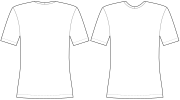

Controls how deep the neck opening is cut out in the back compared to the depth in the front.

For example a value of 50% makes the back neck opening half as deep as in the front.
A value of 100% makes the back neck opening the same depth as in the front.
