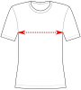

Controls the amount of ease at the bust. This option fine-tunes the strength of the full bust adjustment (FBA)
and will by default add slight negative ease (and thus extra compression) to the bust area.

Values smaller than zero add negative ease to the bust (on top of the chest ease), which reduces the effect
of the [bust adjustment](/docs/designs/toni/options/draftforhighbust/). This can add a bit of support/compression
to the bust and reduces the default strength of the bust adjustment a bit, so that it is not unnecessarily performed
for people without or with only smaller breasts.

Values larger than zero add positive ease to the bust (on top of the chest ease), which increases the effect
of the [bust adjustment](/docs/designs/toni/options/draftforhighbust/) and will add extra room for breasts or padding,
if desired.

