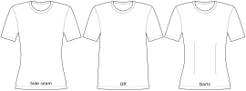

This option determines how the design will try to fit your waist.

The waist can be either fitted using the side seam (which is the default and often used on read-to-wear shirts),
or using (princess) darts.

Or you can disable fitting the waist completely, which makes sense if you want to go for a boxy/masculine look.

While princess darts/seams are untypical for a knit wear top, we provide them as a template for
your custom modifications. They may be useful if you already want to add vertical seams for color blocking
or if you require more extensive shaping because of low-stretch fabric and a very curvy body.

:::tip
Instead of turning the waist fitting on or off, you can also set the waist ease to any value to fine-tune
the exact shape you want.
:::
