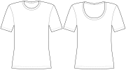

This option controls the neck ease.

The neck ease is a factor based on the selected measurement from the [Neck opening based on](/docs/designs/toni/options/neckbasedon/) option.

Changing the neck opening size will primarily change the depth at the front and back,
however, it can also increase the width if necessary.

