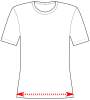

import Knitease from '@site/docs/docs/designs/toni/options/_knitease.mdx'

Controls the amount of ease at your seat.

Note that the software will never make the seat smaller than the waist, so setting this to very low values
might not have any effect.

<Knitease />
