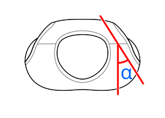

This option determines the angle at which the straps (for sleeveless designs) or the neck hole curves (for designs with sleeves) go over the shoulder when viewed from above.

This can be a stylistic choice but also affect the fit of the shirt, especially around the back of the neck.

