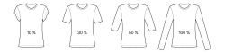

Controls the length of the sleeves, measured as a percentage from the distance of your shoulder point to the wrist.

The sleeve length can be set to a shorter length than the shoulder-to-biceps-circumference measurement.
In that case, the hem of the sleeves will be curved to match the desired length on the top side while keeping enough fabric near the armpit.

The following values are typical values for the sleeve length setting, depending on the look you want to achieve:

| Sleeve type    | Sleeve length | Notes                                       |
| -------------- | ------------- | ------------------------------------------- |
| Cap            | ≈10%          | Consider using Dolman-style sleeves instead |
| Very Short     | ≈20%–30%      | Common for ready-to-wear women's t-shirts   |
| Short          | ≈30%–40%      | Common for ready-to-wear men's t-shirts     |
| Elbow Length   | ≈50%          |                                             |
| Three quarters | ≈75%          |                                             |
| Long           | ≈100%         | Goes to your wrist                          |

