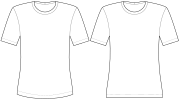

This option controls if you want a curved or straight hem.

The default option is a curved hem, which can create an A-line effect for people with wider hips if the top is long enough.

Alternatively, you can select a straight hem, which may look better if you have striped fabric and don't want to cut over the stripes.

A curved hem is recommended in most cases, but especially for more curvy bodies or to achieve a more feminine look.

A straight hem may look better when you're using fabric with horizontal stripes or when aiming for a more rectangular, boxy design.

:::warning
Be careful, the straight hem option may not work very well if your design needs a lot of shaping to account for
curvy bodies!
:::

