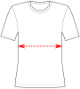

import Knitease from '@site/docs/docs/designs/toni/options/_knitease.mdx'

If (and only if) you request to [fit the waist](/docs/designs/toni/options/fitwaist/), this option allows you to control the amount of ease at the waist.

If the waist is not fitted, this option is disabled.

<Knitease />
